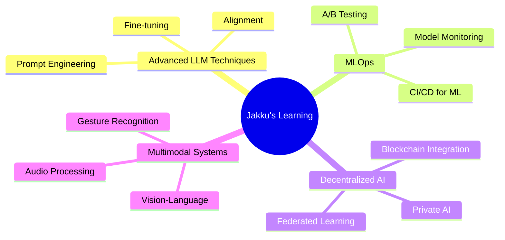

<!-- The Matrix-inspired GitHub Profile - Digital Rain Theme -->

<div align="center">
  


</div>


## `> SYSTEM PROFILE:`

```ascii
--------------------------------------------------------------------------------
| IDENTITY: Jakku Amruth                                                       |
| MISSION: Building advanced AI systems that solve real-world problems         |
| STATUS: Operational // Continuous Learning // System Optimization in Progress |
--------------------------------------------------------------------------------
```

<div align="center">
  <a href="https://linkedin.com/in/jakkuamruth"></a>
  <a href="https://devpost.com/jakkuamruth"></a>
  <a href="mailto:jakku.amruth@example.com"></a>
  <a href="https://yourwebsite.com"></a>
</div>

## `> EXECUTING: current_projects.sh`

<table>
  <tr>
    <td width="50%">
      <h3>🚨 CyberBot</h3>
      <p><code>AI-driven conversational agent with 94% accuracy in cybercrime classification</code></p>
      <div align="center">
        
      </div>
    </td>
    <td width="50%">
      <h3>🛡️ DeepShield</h3>
      <p><code>Next-gen detection system for deepfakes and AI-generated content</code></p>
      <div align="center">
        
      </div>
    </td>
  </tr>
  <tr>
    <td width="50%">
      <h3>⚖️ CrimeChain</h3>
      <p><code>Blockchain-powered tamper-proof evidence management system</code></p>
      <div align="center">
        
      </div>
    </td>
    <td width="50%">
      <h3>🧠 UniComm</h3>
      <p><code>Multimodal accessibility platform for sign language & braille translation</code></p>
      <div align="center">
        
      </div>
    </td>
  </tr>
</table>

## `> cat tech_stack.config`

<div align="center">
  
### `// CORE TECHNOLOGIES`


### `// WEB & DEPLOYMENT`


### `// AI & CLOUD`


</div>

## `> SKILL_MATRIX:`

```
┌────────────────────────────────────────────────────────────────────────────────┐
│                                                                                │
│  [█████████░] AI Architecture & LLM Development                                │
│                                                                                │
│  [████████░░] Computer Vision & Image Processing                               │
│                                                                                │
│  [██████████] Machine Learning & Data Science                                  │
│                                                                                │
│  [███████░░░] Blockchain & Decentralized Systems                               │
│                                                                                │
│  [████████░░] MLOps & Deployment                                               │
│                                                                                │
└────────────────────────────────────────────────────────────────────────────────┘
```

## `> ACHIEVEMENTS.log`

<div align="center">
  
| 🏆 ACHIEVEMENT | 🔑 KEY DETAILS |
|-------------|-------------|
| **Hackathon Champion** | Built production-ready AI solutions in under 48 hours |
| **Innovation Fellow** | Selected for Road to Hacker House & ADI: Buildathon |
| **Speaker** | Featured at Student Tribe Meet, T-Hub Hyderabad on "AI Ethics & Innovation" |
| **Competition Finalist** | Deepfake Detection Challenge & AI-for-Good Global Initiative |
| **Impact Award** | ZeroWasteAI project recognized for reducing food waste by 30% |

</div>

## `> GITHUB ANALYTICS:`

<div align="center">
  
  
  <table>
    <tr>
      <td>
        
      </td>
      <td>
        
      </td>
    </tr>
  </table>
</div>

## `> MEMORY.allocation`

<div align="center">
  <h3>Current Learning Processes:</h3>
  

</div>

## `> TERMINAL`

<div align="center">
  <h3>Connect with me:</h3>
  <p>
    <pre style="background-color: #000; color: #00FF41; padding: 15px;">
  $ connect --with jakku.amruth@example.com
  
  > Initializing connection...
  > Open for collaboration on innovative AI projects
  > Interested in hackathons, research, and building things that matter
  > Connection established. Ready to build the future together.
    </pre>
  </p>
</div>

<div align="center">
  
  
  <h4>「 There is no spoon. Only code that bends reality. 」</h4>
</div>
