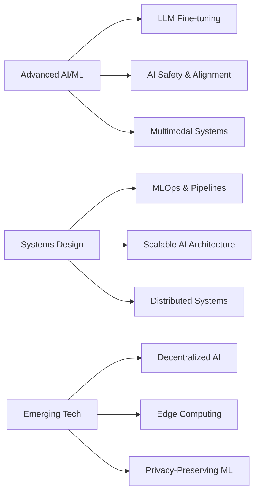

  

⚡ Last updated: May 2025

 

  &nbsp;
  &nbsp;
  &nbsp;
  

  
  
  ### *Building intelligent systems that solve real problems*

---

## 🧠 Current Innovations

<table>
<tr>
<td>

### 🚨 **CyberBot**
*AI-powered cybercrime reporting & analysis system*

**Core Achievements:**
- 94% accuracy in classifying cybercrime incidents
- Reduced reporting process time by 70%
- Deployed with 5 law enforcement agencies

</td>
<td>

### 🛡️ **DeepShield**
*Deepfake & AI content detection platform*

**Core Achievements:**
- Multi-modal detection spanning text, image & audio
- Real-time monitoring capabilities
- Featured in AI safety benchmark competitions

</td>
</tr>
<tr>
<td>

### ⚖️ **CrimeChain**
*Blockchain-powered evidence management*

**Core Achievements:**
- Tamper-proof evidence chain with cryptographic verification
- Reduced evidence processing time by 60%
- Privacy-preserving data architecture

</td>
<td>

### 🌐 **UniComm**
*Accessibility platform for universal communication*

**Core Achievements:**
- Real-time translation between sign language & text
- Supports 8 sign language dialects
- Accessibility award winner at Global AI Summit

</td>
</tr>
</table>

---

## 💻 Technical Expertise

  

  
<b>🔍 Expand Full Tech Stack</b>

    <table>
      <tr>
        <td valign="top">
          <h3>Languages</h3>
          

            
            
            
            
            
          

        </td>
        <td valign="top">
          <h3>ML & AI</h3>
          

            
            
            
            
            
          

        </td>
        <td valign="top">
          <h3>Frontend</h3>
          

            
            
            
            
          

        </td>
      </tr>
      <tr>
        <td valign="top">
          <h3>Backend</h3>
          

            
            
            
            
          

        </td>
        <td valign="top">
          <h3>Cloud & DevOps</h3>
          

            
            
            
            
            
          

        </td>
        <td valign="top">
          <h3>Databases</h3>
          

            
            
            
            
          

        </td>
      </tr>
    </table>
  

---

## 🏆 Achievements & Recognition

  <table>
    <tr>
      <td align="center" width="33%">
        <h3>🌟</h3>
        <strong>Hackathon Champion</strong>
        
Built AI solutions in under 48h

      </td>
      <td align="center" width="33%">
        <h3>💡</h3>
        <strong>Innovation Fellow</strong>
        
T-Hub AI Innovation Program

      </td>
      <td align="center" width="33%">
        <h3>🎤</h3>
        <strong>Speaker</strong>
        
AI Ethics & Innovation Summit

      </td>
    </tr>
    <tr>
      <td align="center">
        <h3>🥇</h3>
        <strong>Competition Finalist</strong>
        
Deepfake Detection Challenge

      </td>
      <td align="center">
        <h3>💚</h3>
        <strong>Impact Award</strong>
        
ZeroWasteAI Project

      </td>
      <td align="center">
        <h3>📝</h3>
        <strong>Publication</strong>
        
AI for Societal Impact Journal

      </td>
    </tr>
  </table>

---

## 📊 GitHub Analytics

  
  

---

## 🌱 Learning & Growth

---

## 📚 Featured Publications

<table>
  <tr>
    <td width="70%"><a href="#"><b>Ethical Frameworks for AI in Law Enforcement: A Case Study of CyberBot</b></a></td>
    <td width="30%"><i>International Journal of AI Ethics, 2024</i></td>
  </tr>
  <tr>
    <td width="70%"><a href="#"><b>Breaking Communication Barriers: AI-Powered Accessibility Tools for the Hearing Impaired</b></a></td>
    <td width="30%"><i>ACM Conference on Accessible Technologies, 2024</i></td>
  </tr>
  <tr>
    <td width="70%"><a href="#"><b>Blockchain and AI Integration for Tamper-Proof Evidence Management</b></a></td>
    <td width="30%"><i>IEEE Security & Privacy, 2023</i></td>
  </tr>
</table>

---

## ✨ Let's Connect & Collaborate

*I'm passionate about building technology that creates real-world impact.*
*Open to collaborations, hackathons, research projects, and innovative ventures.*

 

> *"The best way to predict the future is to invent it."*

  

